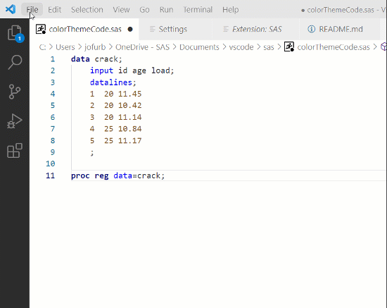
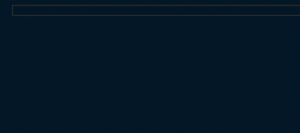
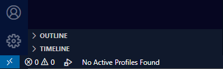
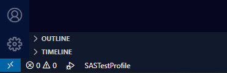

# SAS Extension for Visual Studio Code

Welcome to the SAS Extension for Visual Studio Code! This extension provides support for the [SAS language](https://go.documentation.sas.com/doc/en/pgmsascdc/9.4_3.5/lrcon/titlepage.htm), including the following features:

- [SAS Extension for Visual Studio Code](#sas-extension-for-visual-studio-code)
  - [Installation](#installation)
  - [Features](#features)
    - [SAS Syntax Highlighting](#sas-syntax-highlighting)
    - [Color Themes](#color-themes)
    - [Code Completion](#code-completion)
    - [Pop-up Syntax Help](#pop-up-syntax-help)
    - [Snippets](#snippets)
    - [Code Folding and Code Outline](#code-folding-and-code-outline)
    - [Configuring the SAS Extension](#configuring-the-sas-extension)
    - [Profiles](/connect-and-run.md/#profiles)
      - [Profile Details (Viya)](/connect-and-run.md/#profile-sas-viya)
      - [Add New SAS Viya Profile](/connect-and-run.md#add-new-sas-viya-profile)
      - [Profile Details (SAS 9.4 Remote SSH)](/connect-and-run.md/#profile-sas-94-remote---ssh)
      - [Add New SAS 9.4 Remote SSH Profile](/connect-and-run.md#add-new-sas-94-remote---ssh-profile)
      - [Profile Details (SAS 9.4 Local)](/connect-and-run.md/#profile-sas-94-local)
      - [Add New SAS 9.4 Local Profile](/connect-and-run.md/#add-new-sas-94-local-profile)
      - [Profile Details (SAS 9.4 Remote IOM)](/connect-and-run.md/#profile-sas-94-remote---iom)
      - [Add New SAS 9.4 Remote IOM Profile](/connect-and-run.md/#add-new-sas-94-remote---iom-profile)
      - [Delete SAS Profile](/connect-and-run.md#delete-connection-profile)
      - [Switch Current SAS Profile](/connect-and-run.md#switch-current-connection-profile)
      - [Update SAS Profile](/connect-and-run.md#update-connection-profile)
    - [Running SAS Code](/connect-and-run.md#running-sas-code)
    - [Accessing SAS Content](#accessing-sas-content)
    - [Accessing Libraries and Tables](#accessing-libraries-and-tables)
    - [SAS Notebook](#sas-notebook)
  - [Support](#support)
    - [SAS Communities](#sas-communities)
    - [SAS Programming Documentation](#sas-programming-documentation)
    - [FAQs](#faqs)
    - [GitHub Issues](#github-issues)
  - [Contributing to the SAS Extension](#contributing-to-the-sas-extension)
  - [License](#license)

## Installation

To install the SAS extension, open the Extensions view by clicking the Extensions icon in the Activity Bar on the left side of the Visual Studio Code window. Search for the 'Official' SAS extension, and click the Install button. Once the installation is complete, the Install button changes to the Manage button.

## Features

### SAS Syntax Highlighting

The SAS extension highlights these syntax elements in your program, just as they would appear in a SAS editor:

- Global statements
- SAS procedures
- SAS procedure statements
- Data step definition
- Data step statements
- SAS data sets
- Macro definition
- Macro statements
- Functions
- CALL routines
- Formats and informats
- Macro variables
- SAS colors
- Style elements and style attributes
- Comment
- Various constants
- Options, enumerated option values, sub-options and sub-option values for various procedure definitions and statements

### Color Themes

You can choose among three SAS-related color themes that control the color of the application and syntax elements. The SAS Light, SAS Dark and SAS High Contrast options mirror the themes available in SAS Studio.

To specify the color theme:

- Select `File > Preferences > Color Theme` and select the theme, by name. The image below demonstrates the process changing from SAS Light to SAS Dark.

### Code Completion

The SAS extension includes automatic code completion and pop-up syntax help for SAS keywords. The autocomplete, or code completion, feature in the code editor can predict the next word that you want to enter in your SAS program. See code completion in action below.

To use the autocomplete feature:

- Start typing a valid SAS keyboard. Scroll through the pop-up list of suggested keywords by using your mouse or the up and down arrow keys.

### Pop-up Syntax Help

The syntax help gets you started with a hint about the syntax or a brief description of the keyword. You can get additional help by clicking the links in the syntax help window.

To view the syntax help:

- Move the mouse pointer over a valid SAS keyword in the code.

In the following example, the help panel displays syntax help for the DATA= option in the PROC PRINT statement.

_Tip_: Click the links in the syntax help window to navigate to the SAS online help.

### Snippets

Snippets are lines of commonly used code or text that you can insert into your program. The SAS extension includes snippets for SAS functions and procedures to facilitate writing your SAS programs.

To access the list of snippets for a function or procedure:

- Type the name of a function or procedure in your SAS program. This example shows a snippet for the PROC DS2.

### Code Folding and Code Outline

Regions of code are identified in your SAS program as blocks of code that can be collapsed and expanded. You can also view an outline of your program that identifies DATA steps, procedures, macro sections, and user-defined regions of code.

_Tip_: You can define a custom region by adding `/*region*/` and `/*endregion*/` tags to the start and end of the block of code.

### Configuring the SAS Extension

Before running SAS code, you must configure the SAS extension to access a SAS 9.4 (remote or local) or Viya server. You must license SAS 9.4 or Viya to run SAS code.

1. When first configuring, open up a file with the SAS language. "No Profile" can be located on the Status Bar located at the bottom left of your VSCode window

   

2. Either select the "No Profile" Status Bar Item or open the command palette (`F1`, or `Ctrl+Shift+P` on Windows or Linux, or `Shift+CMD+P` on OSX) and locate `SAS: Add New Connection Profile`
3. Please refer to the [Add SAS Connection Profile](#add-new-sas-profile) section below to add a profile
4. After a profile is created, the Status Bar Item will be changed from "No Profile" to the name of the new profile.

   

5. If you do not want to generate results in HTML format, clear the `Enable/disable ODS HTML5 output` setting. This option is enabled by default.

### Profiles

Profiles are easy ways to switch between multiple SAS deployments. For Viya connections, multiple Viya profiles can be used to switch between compute contexts. There is no limit to the amount of profiles that can be stored.

Profiles will be stored into the VSCode settings.json file, and can be modified by hand, if needed.

The following commands are supported for profiles:

| Command             | Title                                  |
| ------------------- | -------------------------------------- |
| `SAS.addProfile`    | SAS: Add New Connection Profile        |
| `SAS.switchProfile` | SAS: Switch Current Connection profile |
| `SAS.updateProfile` | SAS: Update Connection profile         |
| `SAS.deleteProfile` | SAS: Delete Connection profile         |

Details on creating and managing profiles is available on the [Connect and Run page](/connect-and-run.md).

### Running SAS Code

After configuring the SAS extension for your SAS environment, run your SAS program and view the log and results.

Details on running code is available on the [Connect and Run page](connect-and-run.md).

### Accessing SAS Content

After configuring the SAS extension for a SAS Viya environment, you will be able to access SAS Content.

To access SAS Content:

1. Click the SAS icon in VSCode's activity bar.
2. Click Sign In.
3. Your SAS Content should be displayed after sign in. From here, you are able to create, edit, delete, and run files stored on a SAS server.

**Notes**:

- SAS Content requires a profile with a connection to a Viya instance.

### Accessing Libraries and Tables

After configuring the SAS extension for a SAS Viya environment, you will be able to access your connected libraries.

You can use the libraries pane to delete a table, drag and drop tables into your SAS program code, or view a sample of the table data.

### SAS Notebook

Notebook is an interactive experience with Markdown, executable code snippets and corresponding rich outputs organized in cells.

- To create a SAS notebook, select `SAS Notebook` from the `New File...` menu.
- To change a code language, click the `Select Cell Language Mode` button at the bottom end of a code cell.
- To toggle log or ODS output display, click `...` at the side of the output and select `Change Presentation`.
- SAS Notebook can be saved to a `.sasnb` file, shared to others, and open in another VS Code window.

## Support

### SAS Communities

Ask, Find, and Share on the VS Code SAS Extension on the [SAS Programmers Community site](https://communities.sas.com/t5/SAS-Programming/bd-p/programming).

### SAS Programming Documentation

[SAS Programming documentation](https://go.documentation.sas.com/doc/en/pgmsascdc/9.4_3.5/lrcon/titlepage.htm)

### FAQs

Please check the [FAQ](https://github.com/sassoftware/vscode-sas-extension/wiki/FAQ) page for some common questions.

### GitHub Issues

See the [SUPPORT.md](SUPPORT.md) file for information on how to open an issue against this repository.

## Contributing to the SAS Extension

We welcome your contributions! Please read [CONTRIBUTING.md](/CONTRIBUTING.md) for details on how to submit contributions to this project.

## License

This project is subject to the Apache License Version 2.0, a copy of which is included as [LICENSE](LICENSE)
