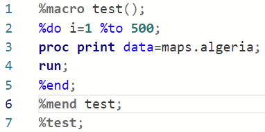
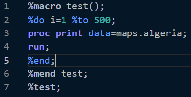
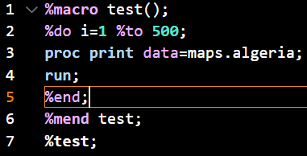
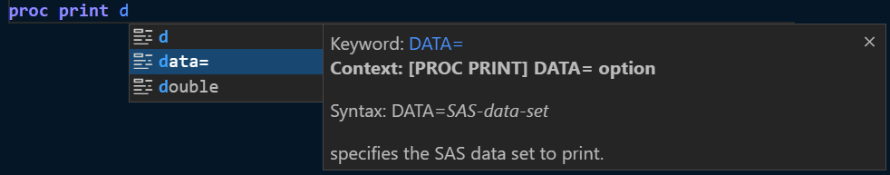
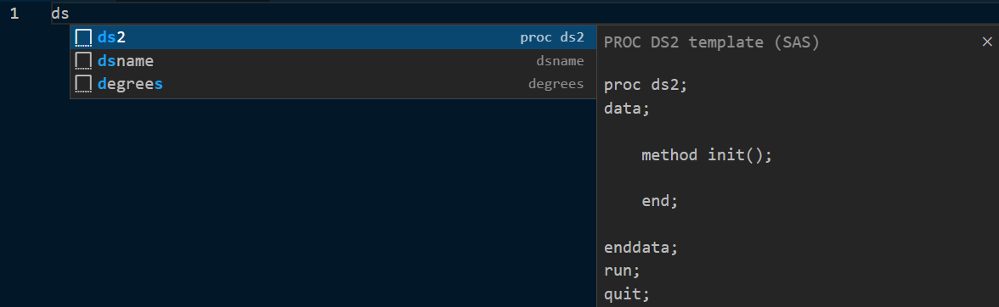
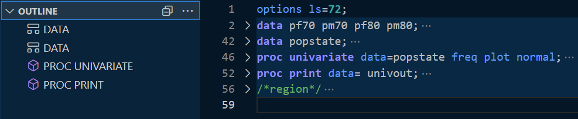
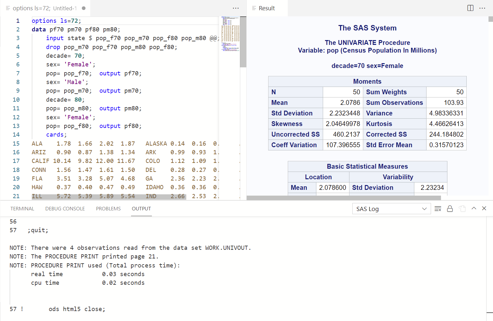

# SAS Extension for Visual Studio Code

Welcome to the SAS Extension for Visual Studio Code! This extension provides support for the [SAS language](https://go.documentation.sas.com/doc/en/pgmsascdc/9.4_3.5/lrcon/titlepage.htm), including the following features:

- [SAS Extension for Visual Studio Code](#sas-extension-for-visual-studio-code)
  - [Installation](#installation)
  - [Features](#features)
    - [SAS Syntax Highlighting](#sas-syntax-highlighting)
    - [Color Themes](#color-themes)
    - [Code Completion](#code-completion)
    - [Pop-up Syntax Help](#pop-up-syntax-help)
    - [Snippets](#snippets)
    - [Code Folding and Code Outline](#code-folding-and-code-outline)
    - [Configuring the SAS Extension](#configuring-the-sas-extension)
    - [Profiles](#profiles)
      - [Profile Anatomy](#profile-anatomy)
      - [Add New SAS Profile](#add-new-sas-profile)
      - [Delete SAS Profile](#delete-sas-profile)
      - [Switch Current SAS Profile](#switch-current-sas-profile)
      - [Update SAS Profile](#update-sas-profile)
    - [Running SAS Code](#running-sas-code)
  - [Contributing to the SAS Extension](#contributing-to-the-sas-extension)
  - [License](#license)

## Installation

To install the SAS extension, open the Extensions view by clicking the Extensions icon in the Activity Bar on the left side of the Visual Studio Code window. Search for the SAS extension, and click the Install button. Once the installation is complete, the Install button changes to the Manage button.

## Features

### SAS Syntax Highlighting

The SAS extension highlights these syntax elements in your program:

- Global statements
- SAS procedures
- SAS procedure statements
- Data step definition
- Data step statements
- SAS data sets
- Macro definition
- Macro statements
- Functions
- CALL routines
- Formats and informats
- Macro variables
- SAS colors
- Style elements and style attributes
- Comment
- Various constants
- Options, enumerated option values, sub-options and sub-option values for various procedure definitions and statements

### Color Themes

You can choose from among different color themes that control the color of the application and syntax elements.

To specify the color theme:

- Select `File > Preferences > Color Theme` and select the theme that you want to use. The SAS extension includes three color themes: SAS Light, SAS Dark, and SAS High Contrast.

- SAS Light

- SAS Dark

- SAS High Contrast

### Code Completion

The SAS extension includes automatic code completion and pop-up syntax help for SAS keywords. The autocomplete, or code completion, feature in the code editor can predict the next word that you want to enter in your SAS program before you enter it completely.

To use the autocomplete feature:

- Start typing a valid SAS keyboard. Scroll through the pop-up list of suggested keywords by using your mouse or the up and down arrow keys.

### Pop-up Syntax Help

The syntax help can get you started with a hint about the syntax or a brief description of the keyword. You can get additional help by clicking the links in the syntax help window.

To view the syntax help:

- Move the mouse pointer over a valid SAS keyword in the code.

In the following example, the help panel displays syntax help for the DATA= option in the PROC PRINT statement.

_Tip_: Click the links in the syntax help window to navigate to the SAS online help.

### Snippets

Snippets are lines of commonly used code or text that you can insert into your program. The SAS extension includes a few snippets for SAS functions and procedures to help you write SAS programs more quickly.

To access the list of snippets for a function or procedure:

- Type the name of a function or procedure in your SAS program. This example shows a snippet for the PROC DS2.
  

### Code Folding and Code Outline

Regions of code are identified in your SAS program as blocks of code that can be collapsed and expanded. You can also view an outline of your program that identifies DATA steps, procedures, macro sections, and user-defined regions of code.

_Tip_: You can define a custom region by adding `/*region*/` and `/*endregion*/` tags to the start and end of the block of code.

### Configuring the SAS Extension

Before you can run SAS code, you must configure the SAS extension to access a SAS Viya server. You must license SAS Viya to run SAS code.

To configure the SAS extension:

1. When first configuring, open up a file with the SAS language. "No Active Profiles Found" can be located on the Status Bar located at the bottom left of your VSCode window
   
2. Either select the "No Active Profiles Found" Status Bar Item or open the command palette (`F1`, or `Ctrl+Shift+P` on Windows or Linux, or `Shift+CMD+P` on OSX) and locate `SAS Session: Add new SAS Profile`
3. Please refer to the [Add New SAS Profile](#add-new-sas-profile) section below to add a profile
4. After a profile is created, the Status Bar Item will be changed from "No Active Profiles Found" to the name of the new profile.
   
5. If you do not want to generate results in HTML format, clear the Get ODS HTML5 Output option. This option is selected by default.

### Profiles

Profiles are easy ways to switch between multiple Viya deployments and Compute Contexts. There is no limit to the amount of profiles that can be stored.

Profiles will be stored into a configuration file. This file will be automatically set to `$HOME/.sas/vs-config.json` after first profile creation, this location can be modified by updating to `Settings -> Settings -> SAS Session: Config File`.

The following commands are supported for profiles:

| Command                     | Title                                   |
| --------------------------- | --------------------------------------- |
| `SAS.session.addProfile`    | SAS Session: Add new SAS profile        |
| `SAS.session.switchProfile` | SAS Session: Switch current SAS profile |
| `SAS.session.updateProfile` | SAS Session: Update SAS profile         |
| `SAS.session.deleteProfile` | SAS Session: Delete SAS profile         |

#### Profile Anatomy

| Name                    | Description                           | Additional Notes                                                                                                                                                                                                  |
| ----------------------- | ------------------------------------- | ----------------------------------------------------------------------------------------------------------------------------------------------------------------------------------------------------------------- |
| **Name**                | Name of the profile                   | This will display on the status bar                                                                                                                                                                               |
| **Endpoint**            | Viya endpoint                         | This will appear when hovering over the status bar                                                                                                                                                                |
| **Compute Context**     | Context for Compute Server            | Please see [SAS Documentation](https://go.documentation.sas.com/doc/en/sasadmincdc/v_014/evfun/p1dkdadd9rkbmdn1fpv562l2p5vy.htm) for more information                                                             |
| **Client ID**           | Registered Client ID for SAS Viya     | Please see your SAS administrator, or follow the [SAS Documentation](https://blogs.sas.com/content/sgf/2021/09/24/authentication-to-sas-viya/) on how to register a client   _Leave empty to use token file_ |
| **Client Secret**       | Registered Client Secret for SAS Viya | Please see your SAS administrator, or follow the [SAS Documentation](https://blogs.sas.com/content/sgf/2021/09/24/authentication-to-sas-viya/) on how to register a client   _Leave empty to use token file_ |
| **SAS Token File Path** | Full Path to Token File               | File must contain only a bearer token to authenticate with the above endpoint   _Will not be used with password flow_                                                                                        |

#### Add New SAS Profile

After executing the `SAS.session.addProfile` command:

1. Enter a Name, Endpoint, and Compute Context, please review [Profile Anatomy](#profile-anatomy) for more information.
2. Select an authentication method from the options below.

   - **Password Authentication:** Specify client ID and client secret. For information about your client ID and client secret, contact your SAS administrator.
   - **Access Token Authentication:** Leave `Client ID` and `Client Secret` empty, then specify the full `SAS Token File Path` for a token file to authenticate with your SAS Viya server.

For more information about the authentication process, please see the blog post [Authentication to SAS Viya: a couple of approaches](https://blogs.sas.com/content/sgf/2021/09/24/authentication-to-sas-viya/).

#### Delete SAS Profile

After executing the `SAS.session.deleteProfile` command:

1. Select profile to delete from the list of profiles
2. A notification message will pop up on successful deletion

#### Switch Current SAS Profile

After executing the `SAS.session.switchProfile` command:

1. If no profiles can be found, the extension will ask to [create a new profile](#add-new-sas-profile)
2. Select profile to set active from the list of profiles
3. The StatusBar Item will update to display the name of the selected profile

#### Update SAS Profile

Update profile gives the ability to modify existing profiles, including updating from password to token flow and vice versa.

After executing the `SAS.session.updateProfile` command:

1. Select profile to update from the list of profiles
2. Complete the prompts to update profile

To update the name of a profile, please delete and recreate it.

### Running SAS Code

After you configure the SAS extension, you can run your SAS program and view the log and results.

To run a SAS program:

1. Click `Run` in the upper right corner of your SAS program window.
2. When you are prompted, enter your password. Your SAS log and any results are displayed in the application.

**Note**:

- A new session must be created the first time you run SAS code. Connection time will vary depending on the server connection.
- Currently, only HTML output is supported. By default, the ODS HTML5 statement is added to the code that you are submitting. You can clear the Get ODS HTML5 Output option in the Settings editor for the SAS extension to disable this output.
- When you click `Run`, the code in the active tab in the editor is submitted. Make sure that the correct tab is active when you run your program.
- To reset your connection to the SAS Viya server, run the `Close current session` command in VS code or click the `Close current session` button next to the `Run` button.
- Please check the [FAQ](https://github.com/sassoftware/vscode-sas-extension/wiki/FAQ) page for some common questions.

## Contributing to the SAS Extension

We welcome your contributions! Please read [CONTRIBUTING.md](/CONTRIBUTING.md) for details on how to submit contributions to this project.

## License

This project is subject to the SAS Code Extension Terms, a copy of which is included as [Code_Extension_Agreement.pdf](/Code_Extension_Agreement.pdf)
