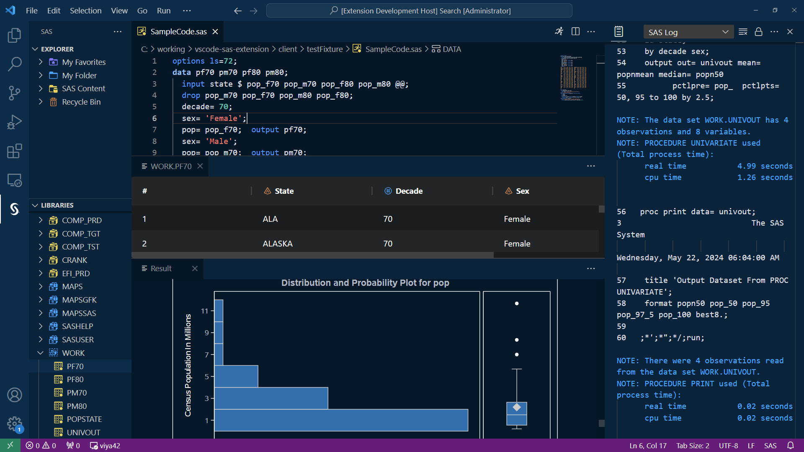

# SAS Extension for Visual Studio Code

[Capabilities](https://sassoftware.github.io/vscode-sas-extension/matrix) | [Installation](https://sassoftware.github.io/vscode-sas-extension/installation) | [Configuration](https://sassoftware.github.io/vscode-sas-extension/Configurations/) | [Features](https://sassoftware.github.io/vscode-sas-extension/Features/) | [FAQ](https://sassoftware.github.io/vscode-sas-extension/faq)

Welcome to the SAS Extension for Visual Studio Code! The SAS extension is lightweight, runs anywhere, and allows you to integrate SAS with other languages. You can connect directly to SAS Viya and SAS 9 and run code.

Before you can run SAS code, you must [configure the SAS extension](https://sassoftware.github.io/vscode-sas-extension/Configurations/) to access your SAS 9.4 (remote or local) server or a SAS Viya server and [add a connection profile](https://sassoftware.github.io/vscode-sas-extension/Configurations/Profiles/).

The SAS extension includes many [features](https://sassoftware.github.io/vscode-sas-extension/Features/) to help you access your data, write and run code, and create SAS notebooks.

- SAS syntax highlighting and help, code completion, and code snippets
- Navigate SAS Content and libraries, including table viewer
- Create notebooks for SAS, SQL, Python, R, Julia, and other languages

## Language Support

The SAS extension provides enhanced language support for embedded languages in SAS notebooks and code files:

- **Python**: Full IntelliSense support (code completion, hover, signature help) is included via Pyright
- **R**: 
  - **In VS Code Desktop**: Basic IntelliSense support (code completion, hover) for common R functions - no installation required
  - **In Browser (VS Code for Web)**: Basic IntelliSense support provided automatically via WebR (no installation required)
- **Julia**: Syntax highlighting and execution via PROC JULIA
- **SQL** and **Lua**: Syntax highlighting and execution support

## Support

### SAS Communities

Ask, Find, and Share on the VS Code SAS Extension on the [SAS Programmers Community site](https://communities.sas.com/t5/SAS-Programming/bd-p/programming).

### SAS Programming Documentation

[SAS Programming documentation](https://go.documentation.sas.com/doc/en/pgmsascdc/v_048/lepg/titlepage.htm)

### FAQs

Please check the [FAQ](https://sassoftware.github.io/vscode-sas-extension/faq) page for some common questions.

### GitHub Issues

See the [SUPPORT.md](SUPPORT.md) file for information on how to open an issue against this repository.

## Contributing to the SAS Extension

We welcome your contributions! Please read [CONTRIBUTING.md](/CONTRIBUTING.md) for details on how to submit contributions to this project.

## License

This project is subject to the Apache License Version 2.0, a copy of which is included as [LICENSE](LICENSE)
