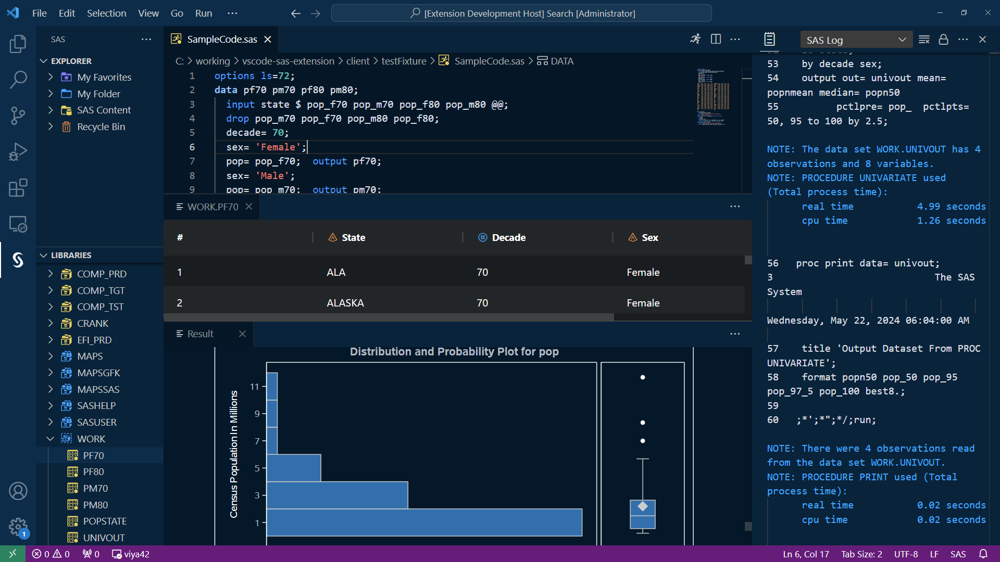

# SAS Extension for Visual Studio Code

[Capabilities](https://sassoftware.github.io/vscode-sas-extension/matrix) | [Installation](https://sassoftware.github.io/vscode-sas-extension/installation) | [Configuration](https://sassoftware.github.io/vscode-sas-extension/Configurations/) | [Features](https://sassoftware.github.io/vscode-sas-extension/Features/) | [FAQ](https://sassoftware.github.io/vscode-sas-extension/faq)

Welcome to the SAS Extension for Visual Studio Code! The SAS extension is lightweight, runs anywhere, and allows you to integrate SAS with other languages. You can connect directly to SAS Viya and SAS 9 and run code.

Before you can run SAS code, you must [configure the SAS extension](https://sassoftware.github.io/vscode-sas-extension/Configurations/) to access your SAS 9.4 (remote or local) server or a SAS Viya server and [add a connection profile](https://sassoftware.github.io/vscode-sas-extension/Configurations/Profiles/).

The SAS extension includes many [features](https://sassoftware.github.io/vscode-sas-extension/Features/) to help you access your data, write and run code, and create SAS notebooks.

- SAS syntax highlighting and help, code completion, and code snippets
- Navigate SAS Content and libraries, including table viewer
- Create notebooks for SAS, SQL, Python and other languages

## Support

### FAQs

Please check the [FAQ](https://sassoftware.github.io/vscode-sas-extension/faq) page for some common questions.

### SAS Programming Documentation

[SAS Programming documentation](https://go.documentation.sas.com/doc/en/pgmsascdc/v_048/lepg/titlepage.htm)

### SAS Communities

For usage questions, tips, and workarounds, interact with other SAS users to ask questions and get answers on the [SAS Programmers Community site](https://communities.sas.com/t5/SAS-Programming/bd-p/programming).

### Reporting Issues

Submit a [GitHub issue](https://github.com/sassoftware/vscode-sas-extension/issues) for tracking bugs, feature requests, or questions regarding open‑source contributions.

### SAS Technical Support

SAS Technical Support provides standard support for the current release of the [SAS Extension for Visual Studio Code](https://marketplace.visualstudio.com/items?itemName=SAS.sas-lsp) available through the [Visual Studio Marketplace](https://marketplace.visualstudio.com/items), in accordance with the [Policies for All SAS Products | SAS Support](https://support.sas.com/en/technical-support/services-policies/policies-for-sas-products.html). If you have been unable to solve a problem or find answers using self‑help resources, open a case in the [Customer Service Portal](https://service.sas.com/csm) to get technical support for the SAS Extension for VS Code.

## Contributing to the SAS Extension

We welcome your contributions! Please read [CONTRIBUTING.md](/CONTRIBUTING.md) for details on how to submit contributions to this project.

## License

This project is subject to the Apache License Version 2.0, a copy of which is included as [LICENSE](LICENSE)
