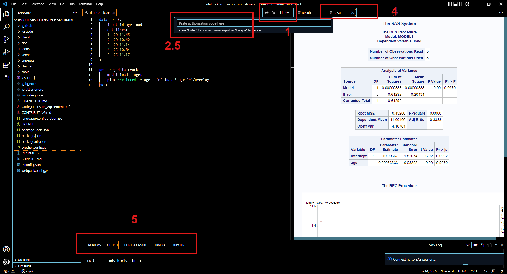

# Connect to SAS and Run Code

# Profiles

Profiles are easy ways to switch between multiple SAS deployments. For SAS Viya connections, multiple Viya profiles are used to switch between compute contexts. There is no limit to the number of stored profiles.

You configure the profiles in VS Code and they will be stored in the VS Code settings.json file. The profile settings can be modified by hand, if needed.

The following commands are supported for profiles:

| Command             | Title                                  |
| ------------------- | -------------------------------------- |
| `SAS.addProfile`    | SAS: Add New Connection Profile        |
| `SAS.switchProfile` | SAS: Switch Current Connection profile |
| `SAS.updateProfile` | SAS: Update Connection profile         |
| `SAS.deleteProfile` | SAS: Delete Connection profile         |

## Profile Anatomy (SAS Viya)

The parameters listed below make up the profile settings for configuring a connection to SAS Viya.

| Name                | Description                           | Additional Notes                                                                                                                                      |
| ------------------- | ------------------------------------- | ----------------------------------------------------------------------------------------------------------------------------------------------------- |
| **Name**            | Name of the profile                   | This will display on the status bar                                                                                                                   |
| **Endpoint**        | Viya endpoint                         | This will appear when hovering over the status bar                                                                                                    |
| **Compute Context** | Context for Compute Server            | Please see [SAS Documentation](https://go.documentation.sas.com/doc/en/sasadmincdc/v_014/evfun/p1dkdadd9rkbmdn1fpv562l2p5vy.htm) for more information |
| **Client ID**       | Registered Client ID for SAS Viya     | Please see your SAS administrator. `authorization_code` and `refresh_token` grant types are required.<br /> _Leave empty for Viya4 2022.11 and later_ |
| **Client Secret**   | Registered Client Secret for SAS Viya | Please see your SAS administrator.<br /> _Leave empty for Viya4 2022.11 and later_                                                                    |

### Add New SAS Viya Profile

Open the command palette (`F1`, or `Ctrl+Shift+P` on Windows or Linux, or `Shift+CMD+P` on OSX). After executing the `SAS.addProfile` command, select the SAS Viya connection type and complete the prompts (with info from the preceeding table) to create a new profile. For SAS Viya Connections, depending on your SAS version, the values for the prompts differ slightly.

- For SAS Viya 2022.11 and later, you can leave Client ID and Client Secret prompts empty and simply press Enter. (The built-in Client ID `vscode` will be used.)
- For SAS Viya 2022.10 and before (including SAS Viya 3.5), you need to provide a Client ID and secret.

For more information about Client IDs and the authentication process, please see the blog post [Authentication to SAS Viya: a couple of approaches](https://blogs.sas.com/content/sgf/2021/09/24/authentication-to-sas-viya/). A SAS administrator can follow the Steps 1 and 2 in the post to register a new client.

## Profile Anatomy (SAS 9.4 Remote)

For a secure connection to SAS 9.4 remote server, a public / private ssh key pair is required. The socket defined in the environment variable `SSH_AUTH_SOCK` is used to communicate with ssh-agent to authenticate the ssh session. The private key must be registered with the ssh-agent. The steps for configuring ssh follow.

### Required setup for connection to SAS 9.4

In order to configure the connection between VS Code and SAS 9, you must configure OpenSSH. Follow the steps below to complete the setup.

#### Windows

1. Enable openssh client optional feature; [instructions found here](https://learn.microsoft.com/en-us/windows-server/administration/openssh/openssh_install_firstuse?tabs=gui).

2. [Create an environment variable](https://phoenixnap.com/kb/windows-set-environment-variable) SSH_AUTH_SOCK with value //./pipe/openssh-ssh-agent (windows uses a named pipe for the auth sock).  
   **Note**: An attempt to create the varible using Powershell command line did not register; suggest using these GUI instructions.

3. Ensure ssh-agent service is running and set startup type to automatic; commands found in [this link](https://dev.to/aka_anoop/how-to-enable-openssh-agent-to-access-your-github-repositories-on-windows-powershell-1ab8)

4. [Generate ed25519 keys](https://medium.com/risan/upgrade-your-ssh-key-to-ed25519-c6e8d60d3c54) with the following command (email address is not binding; use any):

```
     ssh-keygen -o -a 100 -t ed25519 -f ~/.ssh/id_ed25519 -C "youremail@company.com"
```

5. You’ll be asked a series of questions. First, if you didn not provide a path, a default one is provided. Also, if you wish to add a passphrase enter it. Pressing the ‘Enter’ key for each question accepts the default key name and does not password protect your key.

   - Enter a file in which to save the key (/c/Users/you/.ssh/id_ed25519):[Press enter]
   - Enter passphrase (empty for no passphrase): [Type a passphrase]
   - Enter same passphrase again: [Type passphrase again]

6. Define an entry in ~/.ssh/config of the form:

```
    Host host.machine.name
        AddKeysToAgent yes
        IdentityFile /path/to/private/key/with/passphrase
```

Note: if ~/.ssh/config does not exist, run the following Powershell command to create it: `Out-File -FilePath config`

7. Add the private key to ssh-agent: ssh-add /path/to/private/key/with/passphrase

8. In VS Code, define a connection profile (see detailed instructions below in the [Add New SAS 9.4 Remote Profile](#add-new-sas-94-remote-profile) section). The connection for the remote server is stored in the settings.json file.

```
    "ssh_test": {
        "connectionType": "ssh",
        "host": "host.machine.name",
        "saspath": "/path/to/sas/executable",
        "username": "username",
        "port": 22
    }
```

Note: the default path to the SAS executable (saspath) is /opt/sasinside/SASHome/SASFoundation/9.4/bin/sas_u8. Check with your SAS administrator for the exact path.

9. Add the public part of the keypair to the SAS server. Add the contents of the key file to the ~/.ssh/authorized_keys file.

10. Add the public part of the keypair to the SAS server. Add the contents of the key file to the ~/.ssh/authorized_keys file. > > > > > > > 1c9749a1db8834069abad011a75a8f27b7178235 > > > > > > > a970e15a6ba24e07b2298d59389688c419604474

#### Mac

1. Start ssh-agent in the background:
   `    eval "$(ssh-agent -s)"`

2. Ensure that SSH_AUTH_SOCK has a value
   `echo $SSH_AUTH_SOCK`

3. Define an entry in $HOME/.ssh/config of the form:

```
     Host host.machine.name
        AddKeysToAgent yes
        UseKeychain yes
        IdentityFile /path/to/private/key/with/passphrase
```

4. Add the private key to ssh-agent: ssh-add /path/to/private/key/with/passphrase

5. Define a connection profile in settings.json for a remote server (see detailed instructions below in the [Add New SAS 9.4 Remote Profile](#add-new-sas-94-remote-profile) section):

```
    "ssh_test": {
        "connectionType": "ssh",
        "host": "host.machine.name",
        "saspath": "/path/to/sas/executable",
        "username": "username",
        "port": 22
    }
```

6. Add the public part of the keypair to the SAS server. Add the contents of the key file to the ~/.ssh/authorized_keys file.

### Profile Anatomy (SAS 9.4 Remote)

The parameters listed below make up the profile settings for configuring a connection to a remote SAS 9.4 instance.

| Name         | Description                          | Additional Notes                                                     |
| ------------ | ------------------------------------ | -------------------------------------------------------------------- |
| **Name**     | Name of the profile                  | This will display on the status bar                                  |
| **Host**     | SSH Server Host                      | This will appear when hovering over the status bar                   |
| **Username** | SSH Server Username                  | A username to use when establishing the SSH connection to the server |
| **Port**     | SSH Server Port                      | The ssh port of the SSH server. Default value is 22                  |
| **SAS Path** | Path to SAS Executable on the server | Must be a fully qualified path on the SSH server to a SAS executable |

## Add New SAS 9.4 Remote Profile

Open the command palette (`F1`, or `Ctrl+Shift+P` on Windows or Linux, or `Shift+CMD+P` on OSX). After executing the `SAS.addProfile` command, select the SAS 9.4 (remote) connection type and complete the prompts (using values from the preceeding table) to create a new profile.

## Profile Anatomy (SAS 9.4 local)

The parameters listed below make up the profile settings for configuring a connection to a local SAS 9.4 instance.

| Name     | Description                      | Additional Notes                    |
| -------- | -------------------------------- | ----------------------------------- |
| **Name** | Name of the profile              | This will display on the status bar |
| **Host** | Indicates SAS 9.4 local instance | Defaults to localhost for com       |

## Add New SAS 9.4 Local Profile

Open the command palette (`F1`, or `Ctrl+Shift+P` on Windows or Linux, or `Shift+CMD+P` on OSX). After executing the `SAS.addProfile` command, select the SAS 9.4 (local - COM) connection type to create a new profile.

## Delete Connection Profile

After executing the `SAS.deleteProfile` command:

1. Select profile to delete from the list of profiles

2. A notification message will pop up on successful deletion

## Switch Current Connection Profile

After executing the `SAS.switchProfile` command:

1. If no profiles can be found, the extension will ask to [create a new profile](#add-new-sas-profile)

2. Select profile to set active from the list of profiles

3. The StatusBar Item will update to display the name of the selected profile

## Update Connection Profile

Update profile gives the ability to modify existing profiles, including updating from password to token flow and vice versa.

After executing the `SAS.updateProfile` command:

1. Select profile to update from the list of profiles

2. Complete the prompts to update profile

To update the name of a profile, please delete and recreate it.

#### Notes:

- There is a potential issue with switching between multiple profiles on Windows. For more information, see [#215](https://github.com/sassoftware/vscode-sas-extension/issues/215).

# Running SAS Code

After configuring the SAS extension for your SAS environment, run your SAS program and view the log and results. The connection set up and process is different for SAS Viya and SAS 9. Each is explained in detail below.

## SAS Viya

To run a SAS program connection to a SAS Viya instance:

1. Click the running man icon in the upper right corner of your SAS program window.
2. For a secure connection to SAS Viya we use an authorization code for authentication. Complete these steps to connect.

   2.1. VS Code may prompt you that the extension wants to sign in. Click 'Allow'.

   2.2. VS Code may prompt you about opening an external web site. Click 'Open'.

   2.3. This will take you to a SAS Logon prompt. Log in with your SAS credentials.

   2.4. SAS returns an authorization code. Copy this code.

   2.5. Paste the authorization code in VS Code where indicated at the top of the screen.

**Note:** Your sign in status will persist in VS Code. You can view it and sign out from VS Code's `Accounts` menu.

3. VS Code connects to SAS and runs the code.

4. The results are displayed in the application. 5. The SAS output log and error information are displayed in the applicaiton.



**Note:** Your sign in status will persist in VS Code. You can view it and sign out from VS Code's `Accounts` menu.

## SAS 9.4

1. Click the running man icon in the upper right corner of your SAS program window.

2. VS Code connects to SAS and runs the code.

3. The results are displayed in the application.

4. The SAS output log and error information are displayed in the applicaiton.

## Additional notes

To run a piece of SAS code:

- The `Run Selected or All SAS Code` command (`F3`) will automatically run selected code when there's a selection, and run all code when there's no selection.
- When there're multiple selections, The `Run Selected or All SAS Code` command will combine the code from the selections in the order in which they were selected, and then submits the combined code.
- The `Run All SAS Code` command (`F8`) will always run all code regardless of selection.

**Notes**:

- A new session must be created the first time you run SAS code. Connection time will vary depending on the server connection.
- Currently, only HTML output is supported. By default, the ODS HTML5 statement is added to the submitted code. Clear the `Enable/disable ODS HTML5 output` option in the Settings editor for the SAS extension to disable this output.
- When you click `Run`, the code in the active tab in the editor is submitted. Make sure that the correct tab is active when you run your program.
- To reset your connection to SAS, run the `Close Current Session` command in VS Code or click the `Close Current Session` button next to the `Run` button.
