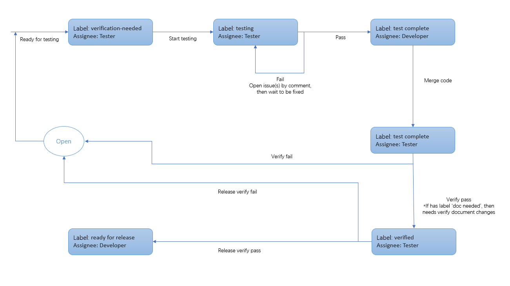

# Developer/Tester Documentation For SAS Extension

## Table Of Contents

- [Getting Started](#getting-started)
- [Contributing To SAS Extension For VSCode](#contributing-to-sas-extension-for-vscode)
- [General Architecture](#general-architecture)
  - [Top level folder structure](#top-level-folder-structure)
  - [Connection setup](#connection-setup)
  - [Model/adapter strategy for tree views](#modeladapter-strategy-for-tree-views)
  - [Working with webviews](#working-with-webviews)
- [Procedure For Bugfixes And Features](#procedure-for-bugfixes-and-features)
- [Testing Unreleased Features](#testing-unreleased-features)
  - [Downloading VSIX files](#downloading-vsix-files)
  - [Installing VSIX files](#installing-vsix-files)
- [Updating Documentation](#updating-documentation)
- [Managing Locales](#managing-locales)
  - [Adding a new locale](#adding-a-new-locale)
  - [Updating a current locale](#updating-a-current-locale)

## Getting Started

- Download and install the current NodeJS LTS version.
- Run `npm install` in this folder. This installs all necessary npm modules in both the client and server folder.
- Open VS Code on this folder.
- Switch to the `Run and Debug` view in the VS Code Activity Bar (Ctrl+Shift+D).
- Select `Launch Client` from the drop down (if it is not already).
- Press ▷ to run the launch config (F5).
- In the [Extension Development Host] instance of VS Code, open a SAS file.
- _Optional_: If you want to debug the language server as well, also run the launch configuration `Attach to Server`.

## Contributing To SAS Extension For VSCode

Please see [CONTRIBUTING.md](../CONTRIBUTING.md) for notes on contributing to the SAS Extension for VSCode

## General Architecture

### Top level folder structure

The following is a high level view of how this project is organized. The majority of contributions are made within the `client/src` directory.

```
.
├── client // Language Client
│   ├── src
|   |   └── browser
│   │   |   └── extension.ts // Language Client entry point for browser
|   |   └── node
│   │       └── extension.ts // Language Client entry point for electron
├── package.json // The extension manifest.
├── server // Language Server
|   └── src
|       └── browser
|       |   └── server.ts // Language Server entry point for browser
|       └── node
|           └── server.ts // Language Server entry point for electron
├── website // Public Documentation
└── tools // Various build tools used by scripts/github actions
```

### Connection setup

Various connection types can be found in `client/src/connection`. These are `itc` (Windows-only based IOM/COM connections), `rest` (Viya connections), and `ssh` (SSH). Each folder has an `index.ts` file responsible for managing the connection. Additionally, there are connection-specific adapters in each of these folders for SAS Content, SAS Server, and Libraries/Tables.

### Model/adapter strategy for tree views

For SAS Content, SAS Server, and Libraries/Tables, we use a model/adapter strategy to work with our various connection types. This allows us to decouple business logic from connection specifics. Here's the general approach, using the libraries pane as an example:

- The entry point for the the libraries pane can be found in `client/src/components/LibraryNavigator/index.ts`. This file connects the front-end UI to the back-end logic through the use of commands.
- Each command dispatches to `LibraryDataProvider`, which provides library data in a format that the extension expects (a tree view)
  - `LibraryDataProvider` uses a `LibraryModel` to get data about libraries and tables
  - `LibraryDataProvider` is connection agnostic
- `LibraryModel` uses a `LibraryAdapter` along with its own logic to get libraries/tables/columns/etc
  - `LibraryModel` is connection agnostic
- `LibraryAdapter` is an interface created to query data from libraries and tables. Concrete implementations of `LibraryAdapter` are instantiated in `LibraryAdapterFactory` and change depending on connection type:
  - `ItcLibraryAdapter` handles connection specifics for IOM/COM connections
  - `RestLibraryAdapter` handles connection specifics for Viya connections

Using this structure, there are a few things to keep in mind:

- Command registration should happen in the outer most layer (i.e. `LibraryNavigator/index.ts`, `ContentNavigator/index.ts`).
- The tree view should be managed by a data provider (i.e `LibraryDataProvider`).
- Any connection-specific features should be defined within concrete adapters in one of the connection folders.

> [!IMPORTANT]
> Any connection-specific features should be defined within concrete adapters in one of the connection folders.

### Working with webviews

Webviews are used to present custom html within the extension (examples of this are the data viewer or table properties).

For each webview, we typically have:

- A `WebView` extension defined in `client/src/panels`
- Css/React/etc defined in `client/src/webview`
- Some build specifics for copying webview files in `tools/build.mjs`

One thing to keep in mind is that webviews have no built-in concept of localization. To get around this, we have `l10nMessages` defined in `WebView`. These messages are injected into the html content and can be used in a webview via the `localize` tool (see `client/src/webview/ColumnMenu.tsx` for an example).

> [!TIP]
> When making changes to files in `client/src/webview`, there is no need to reload the entire extension to see changes take effect. Instead, you can simply close and re-open the webview to see changes.

## Procedure For Bugfixes And Features

Here is the testing process proposal for this project (Code is merged in pull requests only, so testers only need to test "pull request"):

- Developers add label "doc needed" and document content in readme in pull request if it needs document changes.
- Developers link GitHub issues which are to be fixed in the pull request.
- Developers add label "verification-needed" in the pull request which are ready for testing.
- Developers change assignee to Sonny Williams (SW1SAS) in the pull request.
- Sonny Williams assigns it to the correct tester.
- Developers or testers add acceptance criteria tests in the pull request and start testing.
- Testers remove label "verification-needed" and add label "testing" in the pull request. Testers make sure readme is changed if label "doc needed" exists in this PR.
  - If the issues are fixed in topic branch code, testers approve the pull request. Testers remove label "testing" and add label "test complete", then change assignee to developer.
  - If the issues are not fixed in topic branch code, testers add comments in the pull request. Testers wait for developer's investigation and retest updated topic branch build. Once all the issues are fixed in new topic branch build, testers approve the pull request. Testers remove label "testing" and add label "test complete", then change assignee to developer.
- Developers merge code to main branch and change assignee to tester.
- Testers remove label "test complete" and verify the pull request in main branch. Testers verify readme content is changed and correct if label "doc needed" exists in this PR.
  - If the issues are fixed in main branch, testers add label "verified" in pull request.
  - If the issues are not fixed in main branch, testers add comments in the pull request, reopen the pull request and assign it to developer.
  - If no issues are found in the final validation, testers remove label "verified", add label "ready for release" in PRs, and mark the status of the issue to 'Done'
- Managers add the milestone and close the GitHub issue.



## Testing Unreleased Features

You can still try out any commit or pull request (PR) if you don't want to manually build from source code.

### Downloading VSIX files

- Open below page with your browser
  - For main branch https://github.com/sassoftware/vscode-sas-extension/actions/workflows/package.yml
  - For Pull Request https://github.com/sassoftware/vscode-sas-extension/actions/workflows/pr.yml
- Select the commit/PR you want.
- Download the `artifact.zip` file from the Artifacts section.
- Unzip it to get the VSIX file.

### Installing VSIX files

- Open the `Extensions` view on the VS Code Activity Bar.
- Click the `...` from the top right of the Extensions pane, and select `Install from VSIX...`, select the downloaded VSIX file.
- Restart VS Code

**Note**:

- When testing VSIX files, it's usually a good idea to turn off "Extensions: Auto Update" in your VS Code settings to prevent auto-updating to a published version.
- When switching between multiple VSIX files, it's usually a good idea to clean up the [installation directory](https://code.visualstudio.com/docs/editor/extension-marketplace#_where-are-extensions-installed) after uninstalling a previous version. Otherwise VS Code may cache it as un-published versions may look same.

## Updating Documentation

The `website` directory powers the [documentation website](https://sassoftware.github.io/vscode-sas-extension/). Update the markdown files in `website/docs/` directory. It will be built to the website when pushed to the `main` branch. See its [README](./website/README.md) for details.

## Managing Locales

### Adding a new locale

Follow these steps to add a new locale for the SAS Extension for VSCode:

- Follow the instructions in the [Get started](#get-started) section to setup your environment and view results.
- Run `npm run locale --new=<locale>` (the locale specified here will need to be one of https://code.visualstudio.com/docs/getstarted/locales#_available-locales).
- Translate the strings in `package.nls.<locale>.json` and `l10/bundle.l10n.<locale>.json`.
- Install the language pack for your chosen locale and change VSCode's language to the one you're testing.
- Verify your changes using `Launch Client`.
- After you've verified changes, you can create a [pull request](https://docs.github.com/en/pull-requests/collaborating-with-pull-requests/proposing-changes-to-your-work-with-pull-requests/creating-a-pull-request-from-a-fork) for review.

### Updating a current locale

Follow these steps to update a locale for the SAS Extension for VSCode:

- Follow the instructions in the [Get started](#get-started) section to setup your environment and view results.
- Run `npm run locale --update-locale=<locale>`. This will update `package.nls.<locale>.json` and `l10/bundle.l10n.<locale>.json` with any missing translation keys.
- Update any untranslated strings.
- Verify your changes using `Launch Client`.
- After you've verified changes, you can create a [pull request](https://docs.github.com/en/pull-requests/collaborating-with-pull-requests/proposing-changes-to-your-work-with-pull-requests/creating-a-pull-request-from-a-fork) for review.
