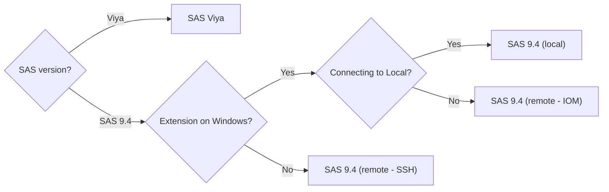

# Capabilities by Connection Type

| SAS Extension for Visual Studio Code - Capabilities by Connection Type                        |      SAS Viya      | SAS 9.4 (local)   SAS 9.4 (remote - IOM) | SAS 9.4 (remote - SSH) | Notes                                                                |
| --------------------------------------------------------------------------------------------- | :----------------: | :------------------------------------------: | :--------------------: | -------------------------------------------------------------------- |
| [SAS Options settings](./Configurations/Profiles/additional.md#sas-options-settings-examples) | :heavy_check_mark: |             :heavy_check_mark:\*             |   :heavy_check_mark:   | \*Startup options not supported for SAS 9.4 (local) and (remote-IOM) |
| [SAS Autoexec settings](./Configurations/Profiles/additional.md#sas-autoexec-settings)        | :heavy_check_mark: |                     :x:                      |          :x:           |
| [Access SAS Content](./Features/accessContent.md)                                             | :heavy_check_mark: |                     :x:                      |          :x:           |
| [Access SAS Server](./Features/accessServer.md)                                               | :heavy_check_mark: |                     :x:                      |          :x:           | SAS 9.4 and SSH support to be added in a future release              |
| [Access connected libraries](./Features/accessLibraries.md)                                   | :heavy_check_mark: |              :heavy_check_mark:              |          :x:           |
| [Table viewer](./Features/accessLibraries.md)                                                 | :heavy_check_mark: |              :heavy_check_mark:              |          :x:           |
| [SAS Notebooks](./Features/sasNotebook.md)                                                    | :heavy_check_mark: |              :heavy_check_mark:              |   :heavy_check_mark:   |
| Convert SAS Notebook to SAS Studio Flow                                                       | :heavy_check_mark: |                     :x:                      |          :x:           |
| [SAS syntax highlighting in SAS code](./Features/sasCodeEditing.md#sas-syntax-highlighting)   | :heavy_check_mark: |              :heavy_check_mark:              |   :heavy_check_mark:   |
| SAS errors, warnings, and notes highlighting in SAS log                                       | :heavy_check_mark: |              :heavy_check_mark:              |          :x:           | A SAS color theme is required.                                       |
| Show problems from SAS log                                                                    | :heavy_check_mark: |              :heavy_check_mark:              |          :x:           |
| [Code folding and code outline](./Features/sasCodeEditing.md#code-folding-and-code-outline)   | :heavy_check_mark: |              :heavy_check_mark:              |   :heavy_check_mark:   |
| [Code completion](./Features/sasCodeEditing.md#code-completion)                               | :heavy_check_mark: |              :heavy_check_mark:              |   :heavy_check_mark:   |
| [Pop-up syntax help](./Features/sasCodeEditing.md#pop-up-syntax-help)                         | :heavy_check_mark: |              :heavy_check_mark:              |   :heavy_check_mark:   |
| [Snippets](./Features/sasCodeEditing.md#snippets)                                             | :heavy_check_mark: |              :heavy_check_mark:              |   :heavy_check_mark:   |
| Able to cancel a running program                                                              | :heavy_check_mark: |              :heavy_check_mark:              |          :x:           |

# Choose Connection Type

:::info

When doing [VS Code Remote Development](https://code.visualstudio.com/docs/remote/remote-overview), the SAS extension is running on the Remote OS.

:::
